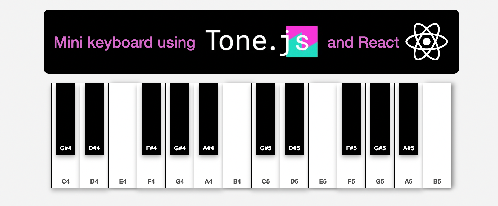
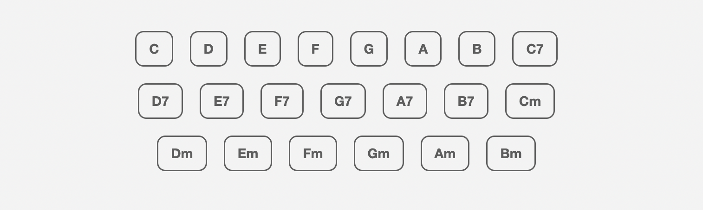

## Mini Piano React App


A mini piano app that uses **React** with custom **CSS** for the UI, **TypeScript** for type safety, and **Tone.js** for the sound synthesis. 

It uses React's **state management and event handling** to manage key presses and chord playback. The app also leverages hooks like **useState, useEffect, and useRef** to handle real-time updates and user interactions. Scaffolded using ```npm create vite@latest```

##

To run locally, clone a copy of this repo and run:

```npm install```

```npm run dev```


## How to use:
- Use computer keyboard to play chords (C, D, E, F, G, A, B).
- To play minor chords, press and hold 'm' before pressing the chord key.
- For seventh chords, press and hold '7'. 
- e.g holding "m" + "g" will play G minor
- Alternatively, you can click the chord buttons or individual keys


##







